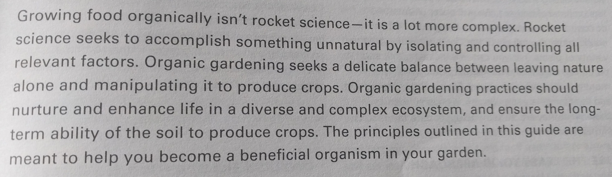

# 1. Permaculture Notes
<!-- TOC -->

- [1. Permaculture Notes](#1-permaculture-notes)
    - [1.1. Some Quotes & Interesting Aspects](#11-some-quotes--interesting-aspects)
    - [1.2. Short Videos ( See these first fully )](#12-short-videos--see-these-first-fully-)
    - [1.3. Longer Materials](#13-longer-materials)
    - [1.4. Irrigation](#14-irrigation)
    - [1.5. Alive Soil](#15-alive-soil)
    - [1.6. Biodiversity & Pests](#16-biodiversity--pests)
    - [1.7. Other Refs ( Just my notes - ignore )](#17-other-refs--just-my-notes---ignore-)

<!-- /TOC -->
## 1.1. Some Quotes & Interesting Aspects

* Opening sentence from [Maritime Northwest Garden Guide](http://www.seattletilth.org/get-involved/aboutmngg). This hammers in a strong perspective  

* Jane Goodall : *"Out in the rainforest, you learn how everything is interconnected and each little species, even though it may seem insignificant, has a role to play in this tapestry of life"*

* Big picture of the philosophy : If you observe forests and nature, all systems are balanced and self-sustaining in a well-running closed-system. Nobody adds fertilizer, controls pests, battles droughts. Only if ones start breaking links and dependencies, the wheel breaks - which is what human engineering does ( non-wholistic ). If you start with the goal that you want to 'grow food for humans', then it is fundamentally is broken from the get go. But if you start with the intenetion on how you will 'design the landscape' in order to work with nature towards a co-operative ecosystem, food will be by-product - not only for you, but for all the birds, insects and animals ( of which you are part ). And looking at practical examples - it is 100x less labor/energy-intensive, regenerative and wholistic self-feedback system - with more than enough bounty for you.

## 1.2. Short Videos ( See these first fully )

* [Miracle Farms](https://www.youtube.com/watch?v=3riW_yiCN5E) - This is an organic orchard farmer who evloved towards permaculture. I think he captures most of the essensce who has practically implemented the principles. For me this is what it is all about - it is not about humans, it is about restoring balance to the ecosystem. [See this specific point](https://youtu.be/3riW_yiCN5E?t=435). I dont agree with killing pests etc. Pests and counter-aspects are an artifact of breaking some chain or balance. And who are we to deny it to the smallest creatures. If balance is restored it will run like who smooth cycle.

* [Aranya](https://www.youtube.com/watch?v=XnTqhayGWrw) This is a working experiment in India ( looks like somewhere in AP). Humble folks, extrordinary effort.

* [Guyton Food Forest](https://www.youtube.com/watch?v=6GJFL0MD9fc) This food forest rocks. Lot of philosophical digressions. [See important point here](https://www.youtube.com/watch?v=6GJFL0MD9fc&feature=youtu.be&t=540)

* [Farm In France](https://www.youtube.com/watch?v=oNreOaTK4BU) Just a nice working farm demo.

* [Make Soil Alive](https://www.youtube.com/watch?v=S5wgHQtxgJwa) This is a small but point-on video from one of the experts in the field. The video itself is about regenerating soil, but [the key point here is so simple and fundamental](https://www.youtube.com/watch?v=S5wgHQtxgJw&feature=youtu.be&t=430) 

* [Shivnanjaiah](https://www.youtube.com/watch?v=wbbMCZ_JrdQ) Simple words of wisdom in Kannada :) Also lot of practical tips for India.

## 1.3. Longer Materials

* [Farm for the Future](https://vimeo.com/136857929) This gives a wide perspective in simple terms. This is a clean simple documentary without going into details. 

* [Permaculture Designers Manual](https://www.amazon.com/Permaculture-Designers-Manual-Bill-Mollison/dp/0908228015) - From the main who developed this concept - 1970ish. Supposed to be the bible book. [Read the first 2 chapters (pdf copy)](./manual.pdf)

* [Midwest Permaculture](https://www.youtube.com/watch?v=gjQ_BXo7hLk&index=1&list=PL8A13FE6DAED398CB) The first video gives some good illustrations on why traditional techniques and industrial agriculture is a nightmare just w.r.t to resource usage.

* [Ashok Kumar](https://www.youtube.com/watch?v=ne01YmP4ZTw)

## 1.4. Irrigation

* [Efficient Irrigation Systems](https://permaculturenews.org/2014/04/24/get-started-efficient-irrigation-systems/)
* [Handeeman Low Water Demo](https://www.youtube.com/watch?v=4IWZZcgZs6Y)
* [Deep Pipe Irrigation](https://www.youtube.com/watch?v=RW0ry4244vE)
* [Olla](https://permaculturenews.org/2010/09/16/ollas-unglazed-clay-pots-for-garden-irrigation/)
* [Deep Drip](http://www.deepdrip.com/agriculture/)
* [Hydrospiral](https://www.youtube.com/watch?v=PRfeZas_wy4)
* [Wicking](https://www.youtube.com/watch?v=VLn2X-g-_7g)

## 1.5. Alive Soil

## 1.6. Biodiversity & Pests

## 1.7. Other Refs ( Just my notes - ignore )

* [Property Choosing Guide](https://www.youtube.com/watch?v=bYe8ds64Bek)
* [Principles In Application](https://www.youtube.com/watch?v=N225HDyIUe8)
* [Worm Tower](https://www.youtube.com/watch?v=1pEq2QkBG4U)
